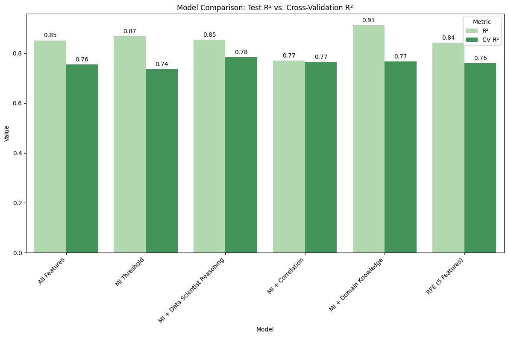

# 🚀 Vehicle Price Prediction: Feature Selection Strategy Analysis 

## 🎯 Executive Summary 
Leveraging experience and knowledge within the automotive sector, this project addresses the critical challenge of pricing accuracy — a high-stakes balancing act between profit margins and sales velocity. It investigates how different feature selection methodologies impact a regression model's ability to generalise. 

By comparing **Domain Expertise** against **Data Scientist Reasoning** and **Algorithmic Selection**, this study identifies the most robust foundation for vehicle pricing models. 

> **Key Result:** While "Domain Knowledge" achieved high raw accuracy, the "Data Scientist Reasoning" approach provided the most stable performance under cross validation, reducing the "generalisation gap" significantly. 

## 🛠 The Challenge 
Is "Domain Expertise" always superior to "Algorithmic Selection"? This study compares five distinct approaches to feature engineering to identify the most robust predictive foundation for vehicle pricing. 

## 🧪 Methodologies Compared 
* **Mutual Information (MI) Statistical Baseline:** Evaluating the raw statistical dependency of features on price as a foundation for the hybrid selection strategies.
* **Correlation Based Reduction:** Systematically removing redundant features to minimize multi-collinearity. 
* **Domain Knowledge Selection:** Manually selecting features based on traditional automotive industry knowledge and assumptions. 
* **Recursive Feature Elimination (RFE):** Using an iterative, model driven approach to prune the feature set. 
* **Data Scientist Reasoning:** An optimised hybrid approach leveraging analytical judgment to balance complexity and predictive power.

## 📈 Results & Visual Analysis 
The study revealed a critical **generalisation gap** between training performance and real world stability.

### Key Observations: 
* **Overfitting in Domain Models:** While the **Domain Knowledge** approach achieved the highest raw accuracy on the test set, its performance dropped significantly during cross validation.
* **Stability of Reasoning:** The **Data Scientist Reasoning** approach achieved the highest cross validation R^2 (78.4%), proving that analytical judgment — when used to bridge domain gaps — creates a more resilient model.
* **Simplification vs. Power:** Algorithmic methods like RFE and Correlation reduction showed that while simplifying a model reduces overfitting, it must be balanced against the loss of predictive power.

## 🚀 Future Roadmap 
* **Automation:** Implementing data pipelines to move from manual preprocessing to a production ready workflow. 
* **Ensemble Modelling:** Evaluating Random Forest and XGBoost to capture higher dimensional feature interactions. 
* **Hyperparameter Optimisation:** Employing strategies such as Grid Search Cross Validation to maximise accuracy while maintaining the identified model robustness.

---

**Tech Stack:** Python, Scikit-Learn, Matplotlib, Pandas.
